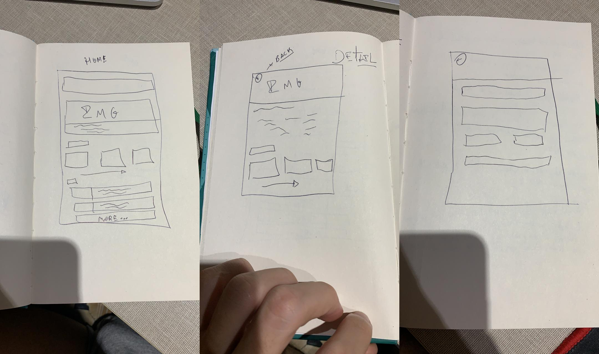
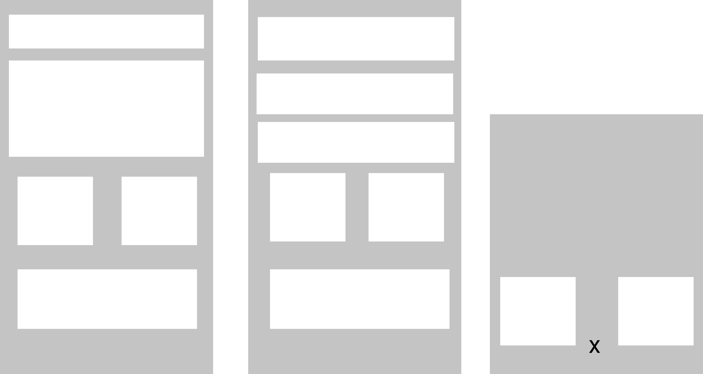
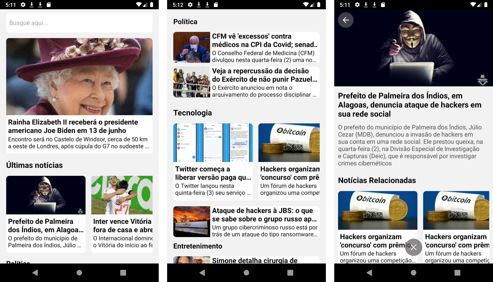

<h1 align="center">
    
</h1>

<h4 align="center">
  🚀 Noticiário
</h4>

  

  
  
  

  

  

  <a href="#rocket-tecnologias">Tecnologias</a>&nbsp;&nbsp;&nbsp;|&nbsp;&nbsp;&nbsp;
  <a href="#-projeto">Projeto</a>&nbsp;&nbsp;&nbsp;|&nbsp;&nbsp;&nbsp;
  <a href="#-layout">Layout</a>&nbsp;&nbsp;&nbsp;|&nbsp;&nbsp;&nbsp;
  <a href="#-como-contribuir">Como contribuir</a>&nbsp;&nbsp;&nbsp;|&nbsp;&nbsp;&nbsp;
  <a href="#memo-licença">Licença</a>

 

  

  

  

## :rocket: Tecnologias

Esse projeto foi desenvolvido com a seguinte tecnologia:

- [React Native](https://facebook.github.io/react-native/)

## 💻 Projeto

O NewCast é um projeto que visa conectar pessoas que estão buscando se manter informadas com as melhores notícias do momento.

## 🔖 Layout

Você pode visualizar o layout do projeto através do [Figma](https://www.figma.com/file/SJ2mgqzpIUH22u3aqHqSnl/NewCast?node-id=0%3A1).

## 🤔 Como contribuir

- Faça um fork desse repositório;
- Cria uma branch com a sua feature: `git checkout -b minha-feature`;
- Faça commit das suas alterações: `git commit -m 'feat: Minha nova feature'`;
- Faça push para a sua branch: `git push origin minha-feature`.

Depois que o merge da sua pull request for feito, você pode deletar a sua branch.

## :memo: Licença

Esse projeto está sob a licença MIT. Veja o arquivo [LICENSE](LICENSE.md) para mais detalhes.

---

Feito com ♥ by Daniel Jerônimo :wave: [Entre em contato!](https://www.linkedin.com/in/danielgjl/)
